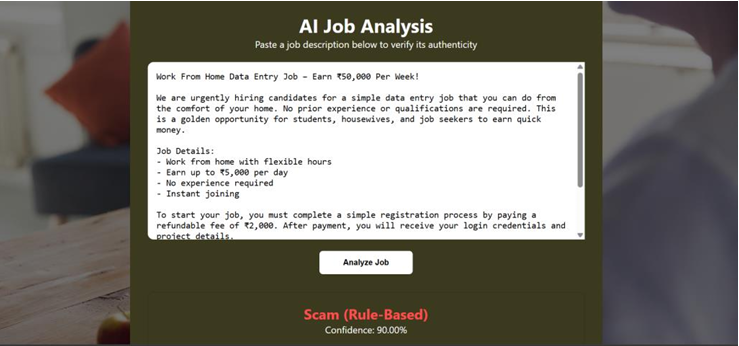
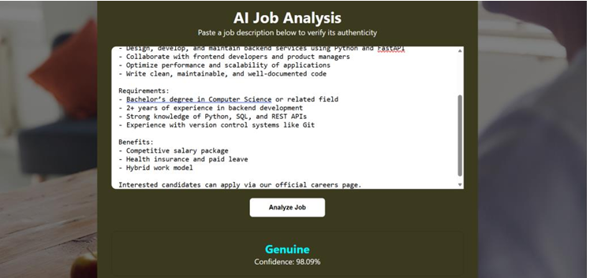
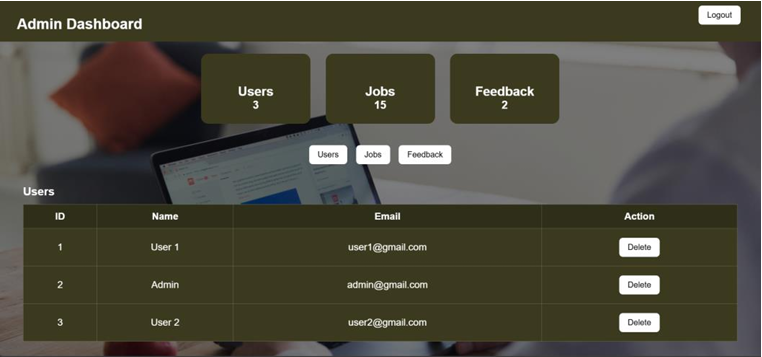
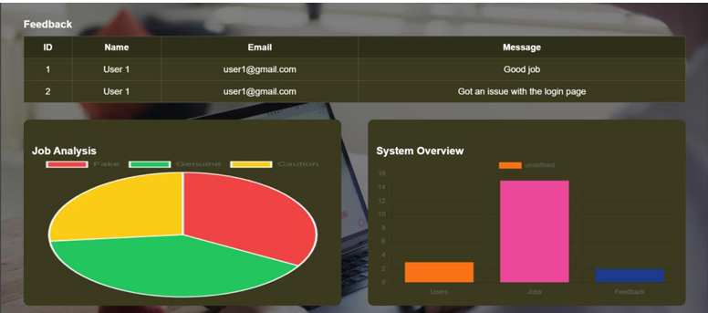

# JobVerifier AI


## Overview

JobVerifier AI is a machine learning-based web application that helps users identify fraudulent job postings. The system analyzes job descriptions using Natural Language Processing (NLP), machine learning, and rule-based detection techniques to classify job advertisements as **Genuine**, **Scam**, or **Caution**.

---

## Features

- User Registration and Login
- Role-Based Authentication (User/Admin)
- Job Description Analysis
- Scam Detection using Machine Learning
- Rule-Based Suspicious Keyword Detection
- Confidence Score Generation
- Feedback Submission System
- Admin Feedback Management

---

## Technologies Used

### Frontend
- HTML
- CSS

### Backend
- FastAPI
- Python

### Database
- MySQL

### Machine Learning
- Scikit-Learn
- TF-IDF Vectorization
- Logistic Regression
- NLTK

---

## Project Structure

```text
backend/
frontend/
model/
notebook/
requirements.txt
README.md
```

---

## Installation

### 1. Clone Repository

```bash
git clone https://github.com/ansubaby-0908/JobVerifierAI.git
cd JobVerifierAI
```

### 2. Create Virtual Environment

```bash
python -m venv venv
```

Activate the environment:

```bash
venv\Scripts\activate
```

### 3. Install Dependencies

```bash
pip install -r requirements.txt
```

### 4. Configure Database

Update the database credentials in:

```text
backend/database.py
```

Create a MySQL database:

```sql
CREATE DATABASE fake_job_detector;
```

### 5. Run the Backend

```bash
cd backend
uvicorn main:app --reload
```

## Model Performance

| Metric | Value |
|----------|----------|
| Algorithm | Logistic Regression |
| Feature Extraction | TF-IDF |
| Accuracy | 96.7% |

---

## Screenshots

### Home Page


### Job Analysis Page





### Admin Dashboard




---

## How It Works

1. User submits a job description.
2. Text is cleaned and transformed using TF-IDF.
3. The Logistic Regression model predicts whether the job is genuine or fraudulent.
4. Rule-based checks look for common scam indicators.
5. The system returns:
   - Classification Result
   - Confidence Score

---

## Future Enhancements

- JWT Authentication
- Resume Analysis
- Company Verification
- Real-Time Job Scraping
- Explainable AI Dashboard
- Deep Learning Models (BERT)
- Browser Extension Support

---